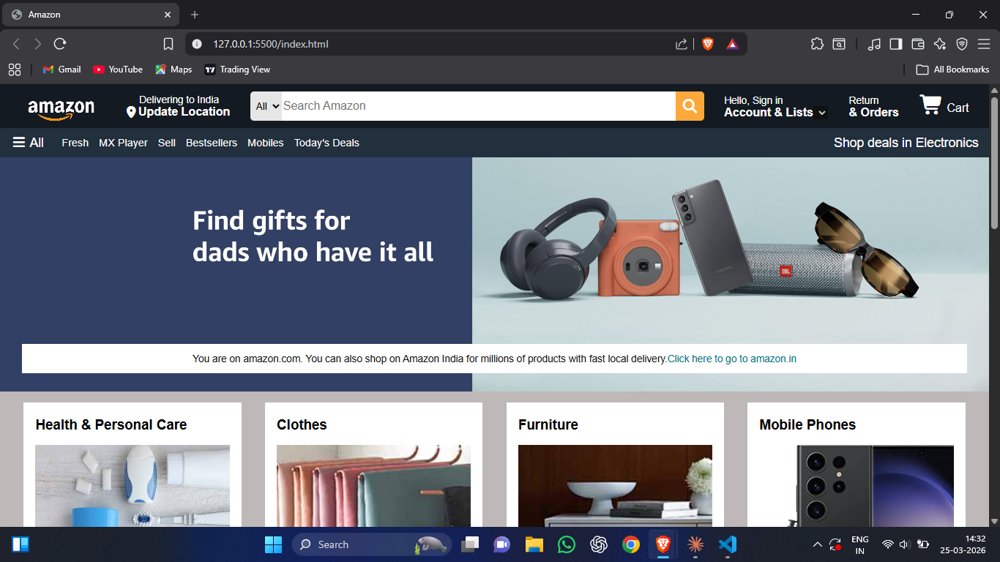
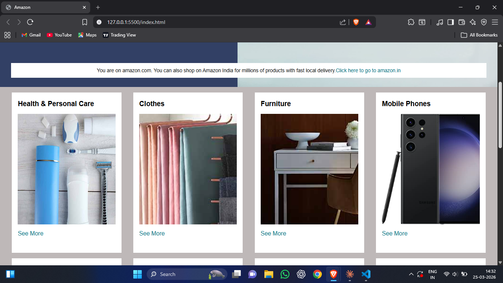
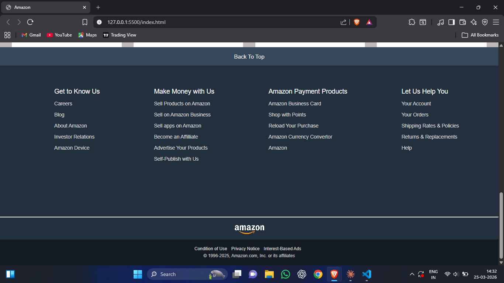

# Amazon Clone (HTML & CSS)

A simple **Amazon homepage clone** built using **HTML and CSS**.
This project was created to practice frontend development by recreating the layout and design of Amazon’s landing page.

## 🚀 Features

* Amazon-style **navigation bar**
* **Hero section**
* **Product items grid**
* **Footer section**
* Clean and structured **HTML & CSS layout**

## 🛠️ Technologies Used

* HTML5
* CSS3

## 📸 Screenshots

### Homepage



### Items Section



### Footer Section



## 📂 Project Structure

```
amazonclone-html-css
│
├── index.html
├── style.css
├── screenshots
│   ├── homepage.png
│   ├── items.png
│   └── footersection.png
└── images
```

## 💻 How to Run

1. Clone the repository

```
git clone https://github.com/vanshhg/amazonclone-html-css.git
```

2. Navigate to the project folder

3. Open **index.html** in your browser.

## 📚 What I Learned

* Creating layouts using HTML
* Styling UI using CSS
* Building real-world UI clones
* Improving frontend fundamentals

## ⭐ Support

If you like this project, feel free to **star the repository**.
